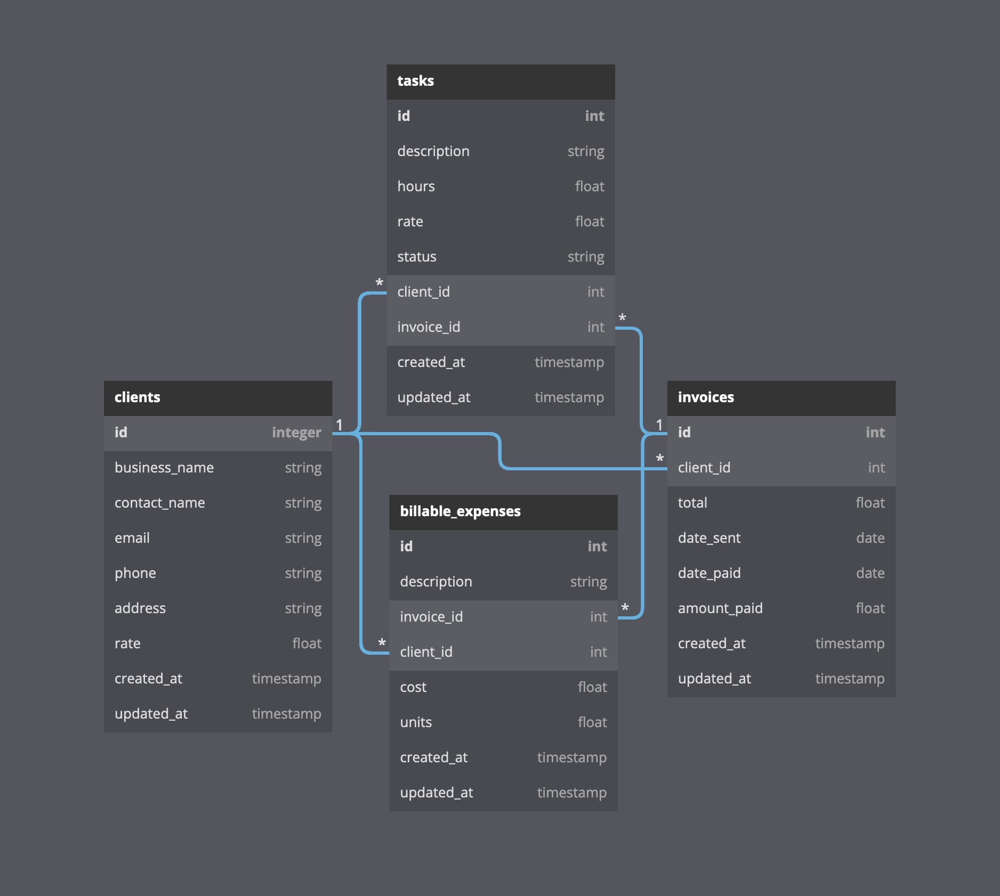

# Thyme is Money

A simple time keeping and invoicing application for freelancers. It is written in Javascript using React, Redux Toolkit, Chakra-UI and Formik for the front end, and Express, Knex and SQLite on the backend.

In it's current form it should be considered a fairly complete school project rather than a production ready piece of software.  There are no known bugs but there are some obvious missing features and it it needs some tidying up.

Originally written by @nicole-ferma, @yuricowan, @dajabe, and @adamshand for their final [DevAcademy Aotearoa](https://devacademy.co.nz/) project in 2022.  

## Screenshots

## Current Features

- Create and edit clients (name, contact, email, address, hourly rate etc)
- Create and edit tasks (description and number of hours)
- Generate PDF invoices using [Invoice Generator API](https://invoice-generator.com/developers)
- Customisable invoice template
- Tasks are marked as complete when invoiced
- Summary page which displays uninvoiced tasks and recent invoices
- Downloadable CSV of all invoices
- Authentication with Auth0
- See all previous invoices for a client

## Future Updates

- Beter reporting on earnings and tax obligations
- Break down information by year
- Convert to Typescript
- Create Docker container for easy use

## Database Schema

